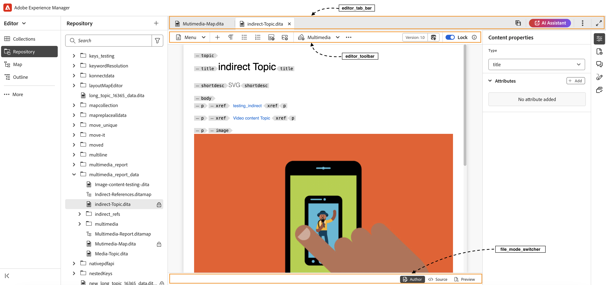
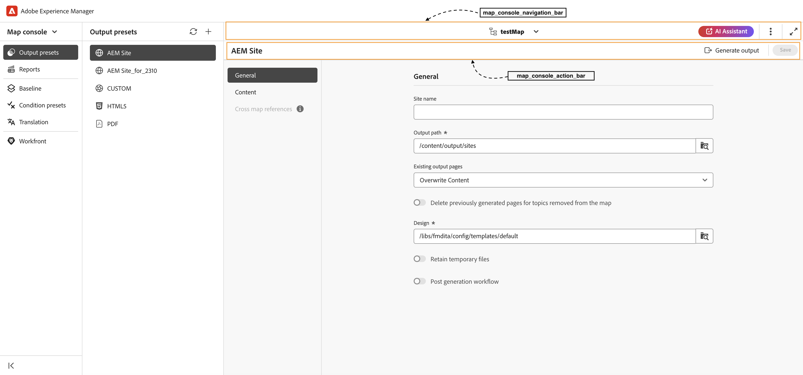
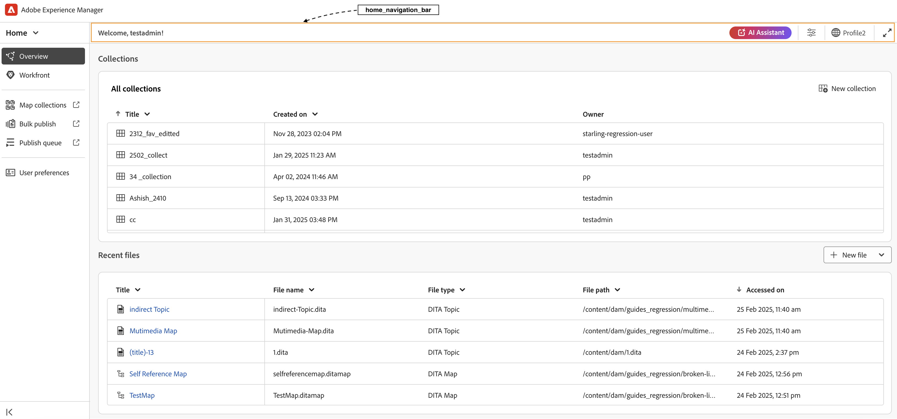
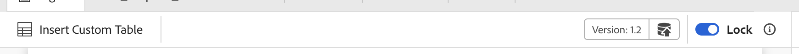
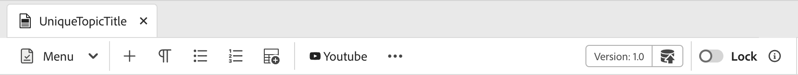
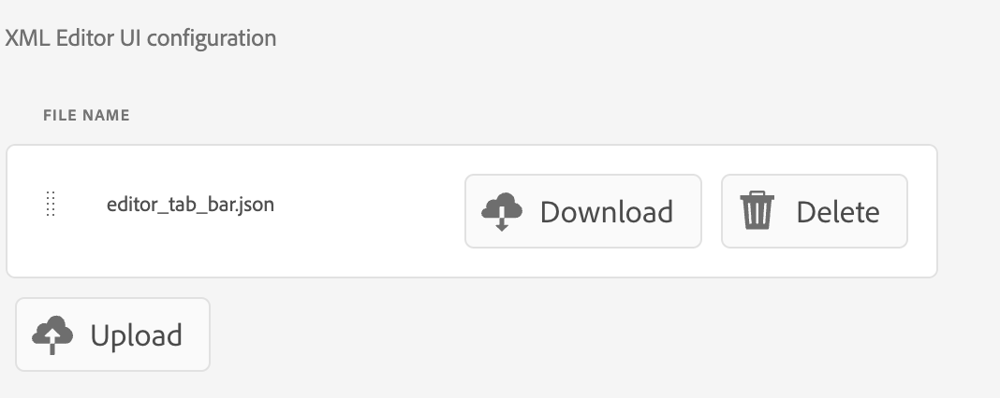
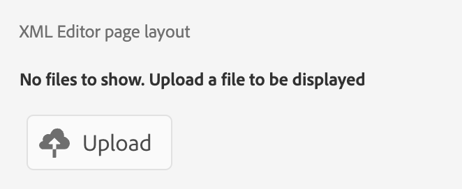
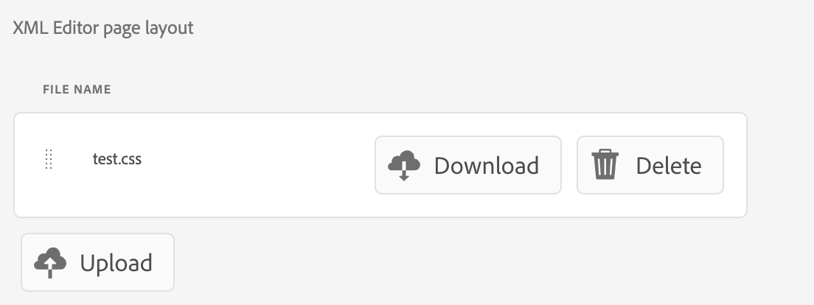
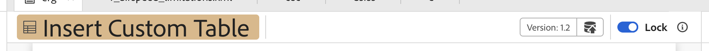
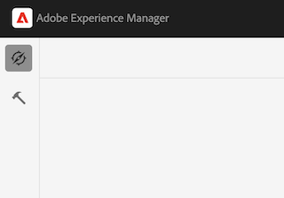

# 概觀

從舊版UI移轉至新AEM Guides UI時，**ui_config**&#x200B;的更新必須轉換為更靈活且模組化的UI設定。 此架構可協助順暢地採用變更至&#x200B;**editor_toolbar**&#x200B;和[其他工具列](/help/courses/course-3/conver-ui-config.md#editing-json-for-different-screens)。 此程式也支援修改應用程式中的其他檢視和Widget。


## 為不同畫面編輯JSON

JSON檔案可新增至各種畫面和Widget的「XML編輯器UI設定」區段。 以下為廣泛使用的Widget及其ID清單：

1. [editor_toolbar](assets/toolbars/editor_toolbar.json)： Webeditor工具列包含檔案與內容動作。
1. [editor_tab_bar](assets/toolbars/editor_tab_bar.json)： webeditor中開啟檔案的索引標籤檢視，有您可以對開啟的檔案執行的動作。
1. [file_mode_switcher](assets/toolbars/file_mode_switcher.json)：它有助於在webeditor內已開啟檔案的不同可用模式（作者、來源、預覽）之間切換。

   

1. [map_console_navigation_bar](assets/toolbars/map_console_navigation_bar.json)：這是在地圖主控台中開啟之地圖的資訊列。 它允許變更地圖並提供設定的存取權。
1. [map_console_action_bar](assets/toolbars/map_console_action_bar.json)：這是對應主控台專案的動作列，例如「輸出預設集」、「基線」、「轉譯」和「報表」，可提供相關資訊及其各自的動作按鈕。

   

1. [home_navigation_bar](assets/toolbars/home_navigation_bar.json)： Guides首頁的頁首列，其中會連同選取的資料夾設定檔一起顯示歡迎訊息。

   

<br>

## 每個JSON的一般結構

每個JSON都遵循一致結構：

1. **id**：指定要自訂元件的Widget。
1. **targetEditor**：使用編輯器和模式屬性定義何時顯示或隱藏按鈕：

   目前系統中有這些&#x200B;**編輯器**&#x200B;和&#x200B;**模式**。

   **編輯器**： ditamap， bookmap， subjectScheme， xml， css，翻譯，預設集， pdf_preset

   **模式**：作者，來源，預覽， toc，分割

   （附註：目錄模式適用於版面檢視。）

1. **target**：指定新元件的加入位置。 這會使用索引鍵值配對或索引來進行唯一識別。 檢視狀態包括：

   * **附加**：在結尾新增。

   * **前置詞**：在開頭新增。

   * **取代**：取代現有元件。

JSON結構範例：

```json
{
  "id" : "editor_toolbar",
  "view": {
    "items": [
      {
        ...,
        "targetEditor": {
          "mode": [
            "preview"
          ],
          "editor": [
            "xml"
          ]
        },
        "target": {
          "key": "label",
          "value": "Table",
          "viewState": "prepend"
        },
        ...
      },
    ]
  }
}
```

<br>

## 範例

以下是如何在編輯器工具列中新增、刪除或取代按鈕的範例。

### 新增按鈕

新增按鈕&#x200B;**在** editor_toolbar **中插入自訂表格**&#x200B;以新增僅在預覽模式中顯示的簡單表格。

```json
{
  "id": "editor_toolbar",
  "view": {
    "items": [
      {
        "icon": "table",
        "title": "Insert Custom Table",
        "on-click": {
          "name": "$$AUTHOR_INSERT_ELEMENT",
          "args": [
            "simpletable",
            "table",
            "choicetable"
          ]
        },
        "key": "$$AUTHOR_INSERT_ELEMENT",
        "targetEditor": {
          "mode": [
            "preview"
          ],
        },
        "target": {
          "key": "label",
          "value": "Table",
          "viewState": "prepend"
        }
      }
    ]
  }
}
```



### 刪除按鈕

從工具列刪除按鈕。 我們在此處從編輯器工具列移除新增影像按鈕。

```json
{
  "id": "editor_toolbar",
  "view": {
    "items": [
      {
        "hide": true,
        "target": {
          "key": "label",
          "value": "Image",
          "viewState": "replace"
        }
      }
    ]
  }
}
```

### 取代按鈕

將工具列中的&#x200B;**多媒體**&#x200B;按鈕取代為&#x200B;**Youtube**&#x200B;連結插入按鈕，此按鈕僅在作者模式中可見。

```json
{
  "id": "editor_toolbar",
  "view": {
    "items": [
      {
        "icon": "s2youtube",
        "title": "Youtube",
        "on-click": {
          "name": "$$AUTHOR_INSERT_ELEMENT",
          "args": "<object data='http://youtube.com'></object>"
        },
        "targetEditor": {
          "mode": [
            "author"
          ]
        },
        "target": {
          "key": "elementId",
          "value": "toolbar-multimedia",
          "viewState": "replace"
        }
      }
    ]
  }
}
```



<br>

## 如何上傳自訂JSON

1. 在&#x200B;**XML編輯器組態**&#x200B;索引標籤上，按一下頂端列中的&#x200B;**編輯**。
1. 現在，在&#x200B;**XML編輯器UI設定**&#x200B;子區段中，您將會看到&#x200B;**上傳**&#x200B;按鈕。

   {width="400" height="150"}

1. 您可以按一下並上傳修改過的json。 （要上傳的json應與正在自訂Widget的ID同名）
1. 上傳後，點選&#x200B;**Save** （在頂端列中）。

   對於每個已上傳的檔案，您也可以&#x200B;**刪除** json以從UI中移除其自訂專案，或&#x200B;**下載**&#x200B;以再次檢視或修改它。

   {width="400" height="150"}

<br>


## 如何上傳自訂的CSS

您也可以新增css ，以自訂新增按鈕或UI上現有小工具或按鈕的外觀。

若是新增的自訂按鈕，請在JSON內的自訂按鈕或元件中新增&#x200B;**擷取類別**。
對於舊類別，您可以檢查元素並修改現有類別。

```json
{
  "icon": "table",
  "title": "Insert Custom Table",
  "extraclass": "custom-css",
  "key": "$$AUTHOR_INSERT_ELEMENT",
  "targetEditor": {
    "mode": [
      "preview"
    ],
  },
  "target": {
    "key": "label",
    "value": "Table",
    "viewState": "prepend"
  }
}
```

1. 在&#x200B;**XML編輯器組態**&#x200B;索引標籤上，按一下頂端列中的&#x200B;**編輯**。
1. 現在，在&#x200B;**XML編輯器頁面配置**&#x200B;子區段中，您將會看到&#x200B;**上傳**&#x200B;按鈕。

   {width="400" height="150"}

1. 您可以按一下並上傳修改過的css。 （僅支援css檔案）
1. 上傳後，點選&#x200B;**Save** （在頂端列中）。

   對於每個已上傳的檔案，您也可以&#x200B;**刪除**&#x200B;從UI移除其CSS自訂專案，或&#x200B;**下載**&#x200B;以再次檢視或修改。

   {width="400" height="150"}


<br>

### 自訂按鈕css的範例

我們在這裡新增一個按鈕&#x200B;**在** editor_toolbar **中插入自訂表格**，以新增僅在預覽模式下可見的簡單表格，並在其上套用自訂css。
此css可修改按鈕的背景及其標題的字型大小。




```css
#editor_toolbar {
  .custom-css {
    background-color: burlywood;
    font-size: 2rem;  
  }
}
```

```json
{
  "id": "editor_toolbar",
  "view": {
    "items": [
      {
        "icon": "table",
        "title": "Insert Custom Table",
        "extraclass": "custom-css",
        ...
      }
    ]
  }
}
```

<br>

## 將ui設定轉換為模組化Json的步驟

1. 從「導覽」畫面中，按一下&#x200B;[!UICONTROL **工具**]&#x200B;圖示。

   

1. 在左側面板上選取&#x200B;**參考線**。

1. 按一下&#x200B;[!UICONTROL **資料夾設定檔**]&#x200B;圖磚。

   

1. 選取資料夾設定檔。

1. 按一下&#x200B;[!UICONTROL **XML編輯器組態**]&#x200B;索引標籤。

1. 您可以按一下&#x200B;**將UI設定轉換為JSON**&#x200B;按鈕。 這會產生&#x200B;**editor_toolbar**&#x200B;和&#x200B;**map_console_action_bar** json，其中包含在&#x200B;**ui_config**&#x200B;中完成的變更。

   

1. 您可以為[編輯器工具列](assets/editor_toolbar.json)和[對應主控台動作列](assets/map_console_action_bar.json)簽出範例產生的json


>[!NOTE]
>
>對&#x200B;**toolbar**&#x200B;和&#x200B;**topbar**&#x200B;區段所做的變更已新增至&#x200B;**editor_toolbar** json，可在「編輯器」頁面上看到。 對&#x200B;**ui_config**&#x200B;中與「預設集」或「翻譯」相關的按鈕所做的變更已新增至&#x200B;**map_console_action_bar** json，您可在「地圖主控台」頁面上看到該按鈕。
